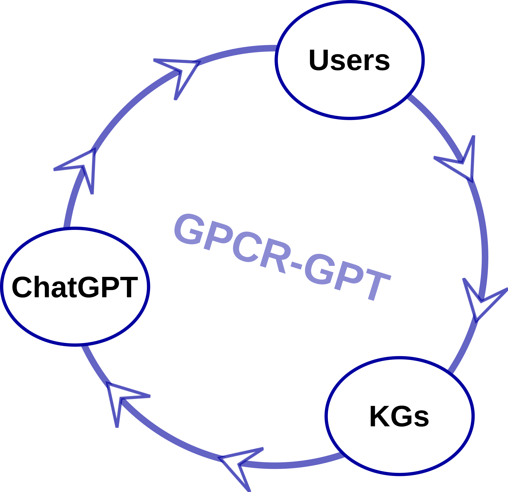
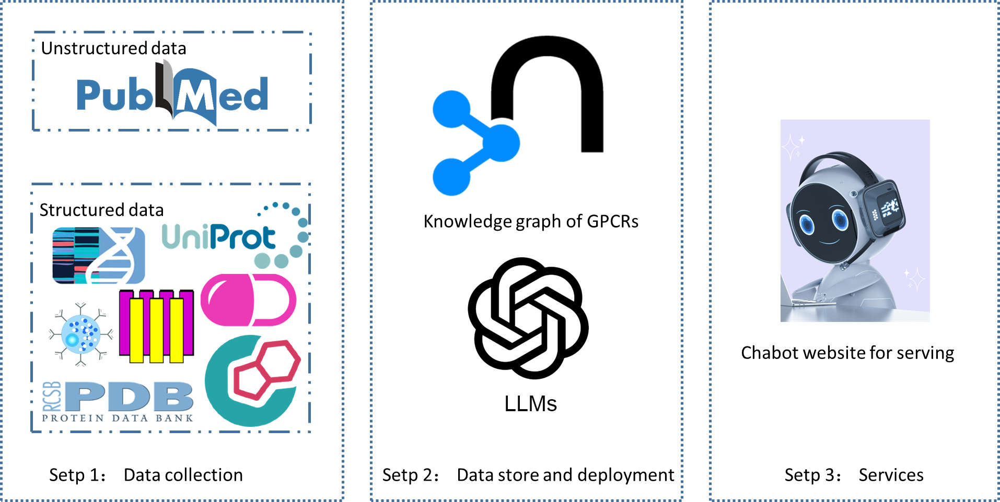
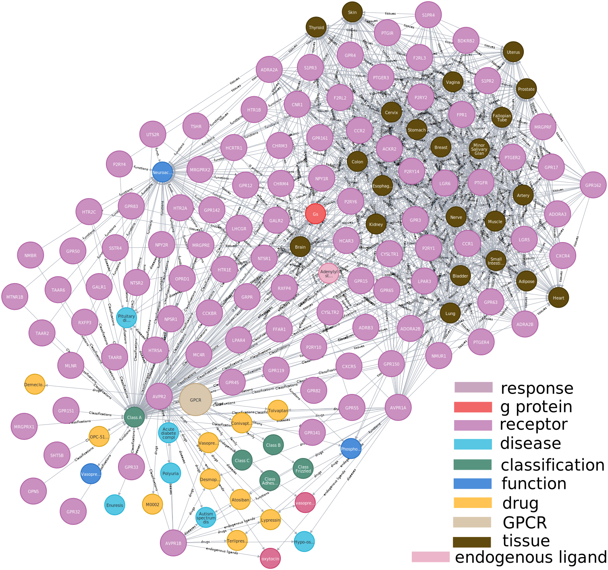

# GPCR-GPT

Our code is only open source for academic users.

## INTRODUCTION


<p align="center">Figure 0. Dataflow.</p>


This project shows the possibility of using the Knowledge graph to improve the ability to answer questions in the large language model. We try to use language models to automatically extract the information of relational triples in literature, and then convert these relational triples into Knowledge graph and use them to improve the ability of big language models to answer user questions in professional fields.
In this study, we chose G protein-coupled receptor, an important Protein superfamily. Use ChatGPT (https://openai.com/blog/chatgpt) to process literature abstracts in the PUBMED database (https://pubmed.ncbi.nlm.nih.gov/) and transform these unstructured text into structured relational triplets. In addition, we also collect GPCR related knowledge from other structured databases and convert this knowledge into relational triplet format. Then, all relational triples are embedded into the same Knowledge graph. Finally, the Knowledge graph was used to improve the ability of these language models to answer questions related to GPCR. When our website receives users' questions, we will first judge whether our Knowledge graph contains information of interest to users through keyword matching. If so, the graph will only answer the user's questions. If not, ChatGPT will answer the user's questions.


<p align="center">Figure 1. Architecture of our research.</p>

## installation

We warmly welcome users to visit our application at http://gpcr-gpt.alphamol.com/. Due to network latency, we cannot guarantee that all users can access our website quickly. Therefore, the code and Neo4j database can be downloaded from our GitHub repository(https://github.com/alphamol-basel/GPCR-GPT), enabling users to install our application locally. This approach will provide users with the flexibility to use the application without relying solely on online access, ensuring a smoother user experience.
For users who failed in installing neo4j can just skip this software and use app_without_neo4.py instead of app.py as the applicatoin.

```
git clone https://github.com/alphamol-basel/GPCR-GPT.git
cd web-GPCRs
```

install python package

```
pip install json==2.0.9 pandas==2.0.3 flask==1.1.2 py2neo==2021.2.3
```

install neo4j on ubuntu

```
apt install apt-transport-https ca-certificates curl software-properties-common -y
curl -fsSL https://debian.neo4j.com/neotechnology.gpg.key | apt-key add -
add-apt-repository "deb https://debian.neo4j.com stable 4.1"
apt install neo4j -y
systemctl enable neo4j.service
systemctl status neo4j.service
```

## usage

```
python app.py
```

Please ensure the 5000 port in you machine is available.


<p align="center">Figure 2. A demo of knowledge graph.</p>

## contact
Shuguang Yuan

shuguang.yuan@alphamol.com
